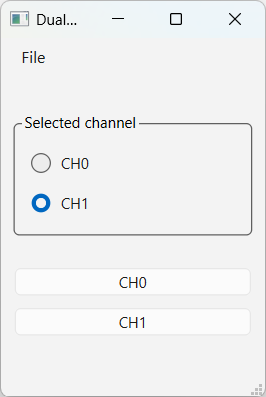
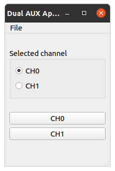

  
  

Dual AUX Application
-----------------------------------------------------------------

This application connects to the Dual AUX device and controls the
bi-stable relay. The application is built for Windows and Linux.

Originally developed with Qt 6.10.0 (toolchain MSVC 2022, x86_64).

